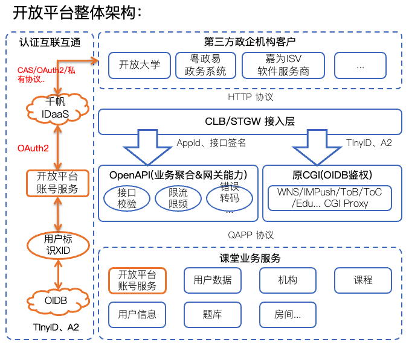
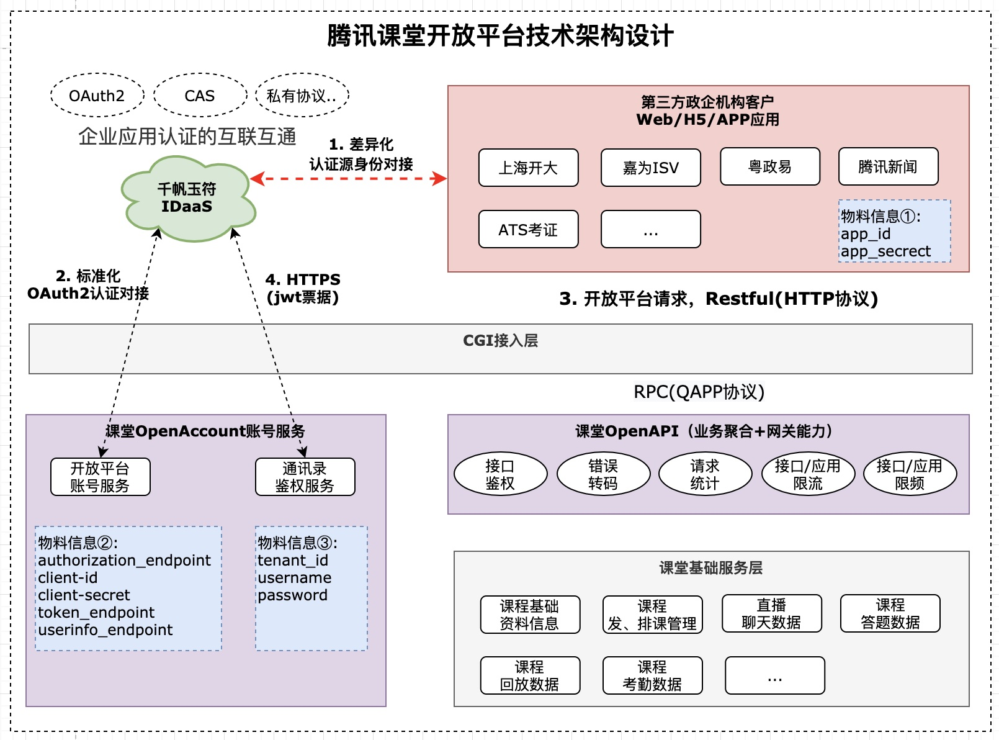
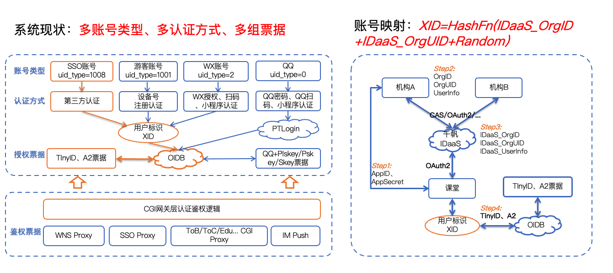

# Open Platform Documents

> 腾讯课堂开放平台APIs, SDKs, 以及相关接入文档

## 整体架构设计

## 课堂账户互通设计

## 文档指引

- [腾讯课堂开放平台接入](开放平台接入.md)
- [OpenAPI 开发指南](openapi/课堂开放平台开发指南.md)
- [OpenAPI SDK 参考](openapi/sdks/signature)
- [第三方企业/机构接入千帆玉符参考](https://docs.qq.com/doc/DSENHR29pQm1EZkt3)
