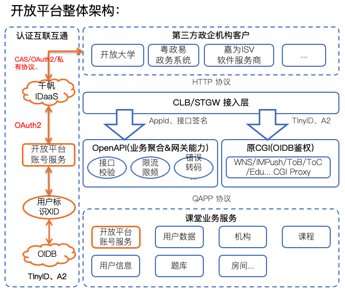
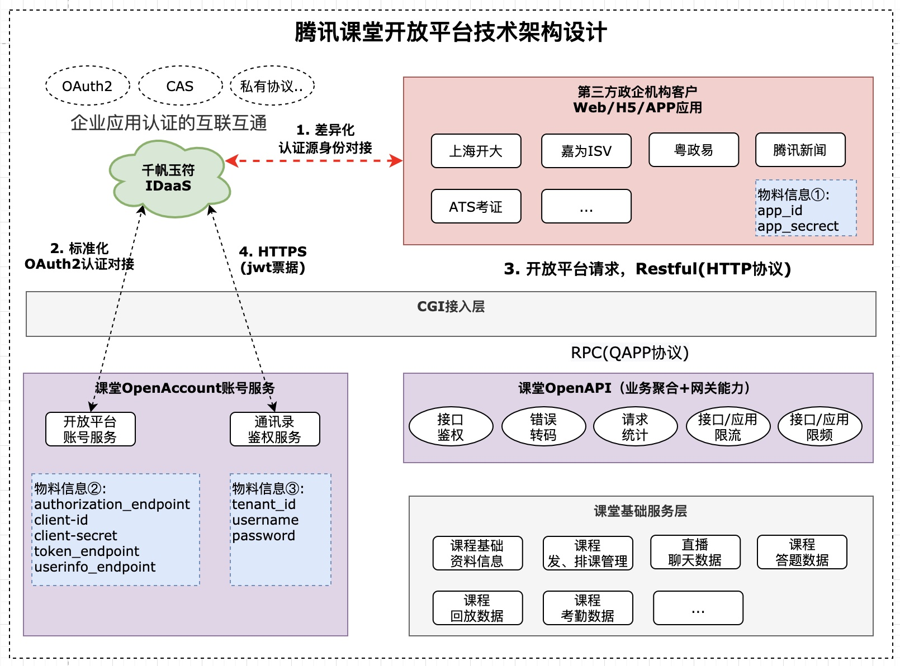
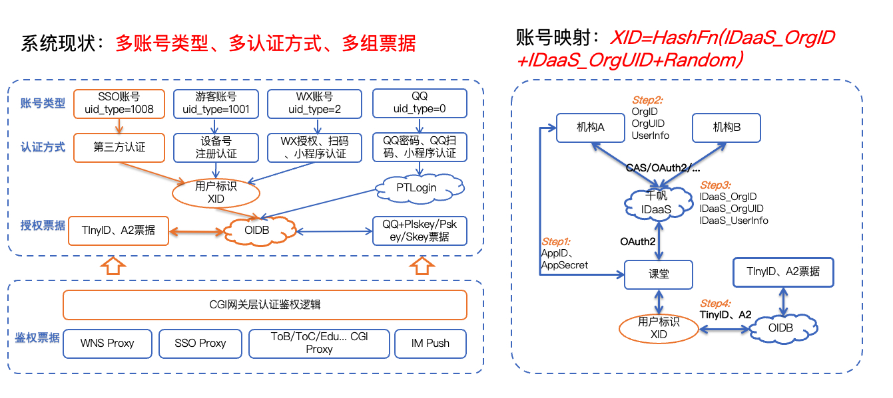
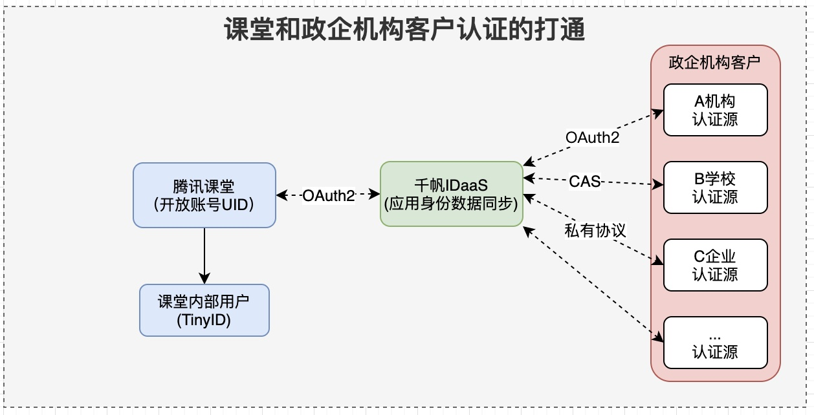

# 腾讯课堂开放平台接入文档

> - 文档版本：v1.1 版本时间: 2023/08/09 补充系统架构设计部分
> - 文档版本：v1.0 版本时间: 2020/10/16

## 开放平台接入总体架构介绍

### OpenAPI、SSO 单点登录设计

### 课堂账户互通

### SSO 单点认证登录

> 课堂对接外部账号，通过 IDaaS 来桥接其他认证源

SSO（SingleSignOn）支持用户使用**第三方企业/机构（认证源）已有账号、密码**接入腾讯课堂等企业内多个业务系统，无需额外记住账号密码，方便快捷。对企业而言，员工通过企业内统一账号使用腾讯课堂，无需额外管理一套员工账号，也确保了参会人员的实名身份，信息可控，更加安全。

课堂与千帆对接以标准 OAuth2 协议交互，千帆 IDaaS 支持适配不同认证协议的第三方机构认证源，来完成认证，最终完成课堂同步登录。

### OpenAPI 教务教学能力

参考附录 OpenAPI 文档地址，现阶段开放平台提供以下开放能力，后续有需要会提供更多赋能：

- **极速发课**：快速创建/修改极速版课程
- **考勤数据**：获取课程的考勤数据
- **答题数据**：获取课程的答题数据
- **聊天数据**：获取课程的聊天数据
- **回放查看**：获取课程的回放数据
- **组织通讯录**: 获取机构组织通讯录数据，用于设置课程可见范围

## 开放能力场景应用

> Tips：课堂老师开课使用**腾讯课堂极速版**电脑客户端开课，学生上课可以通过**课堂 web、H5、APP、腾讯课堂**电脑客户端上课。

### 场景 A：老师在第三方教学系统内开课

- 老师在接入方**教学系统**内，直接发起**创建课程**（通过请求**课堂 OpenAPI**能力实现）
- 老师在接入方**教学系统**内，开始**上课操作**（通过**Ouath2**完成同步登录课堂，并唤起**极速版腾讯课堂**上课）
- 老师在接入方**教学系统**内，查看相关课程数据（通过请求**课堂 OpenAPI**能力实现）
- 老师在接入方**教学系统**内，查看教务教学数据，包括考勤、答题、聊天等数据（通过请求**课堂 OpenAPI**能力实现）
- 老师在接入方**教学系统**内，直接通完成同步登录后，唤起腾讯课堂极速版并自动登录**（参考时序图场景 1）**

### 场景 B：老师账号 SSO 登陆

- 老师可以直接通过打开**腾讯课堂极速版**，在登录页点击**SSO**，使用机构账号完成同步登录后（学生账号无法登录极速版），进入极速版开课/上课操作**（参考视图场景 2）**

### 场景 C：学员在第三方教学系统内上课

- 学员在**接入方教务教学系统内**，直接通过**内嵌上课链接**同步登录课堂，并唤起腾讯课堂客户端进行课程学习（参考时序图场景 1）

### 场景 D：学员账号 SSO 登陆

- 学员通过老师**分享的课链**，通过手机或桌面版浏览器打开，进入**腾讯课堂 web 直播页/课详页，完成 SSO 同步登录**后，进行课程学习
- 学员在 web/h5 页观看**第三方机构**课程中，可以通过点击 web 页中的**打开**按钮，唤起**腾讯课堂客户端**进行课程学习
- 通过**第三方机构教学系统**内的 web/客户端唤起腾讯课堂 web、H5、APP、电脑客户端并自动登录
- 学员可以直接通过打开**腾讯课堂客户**，在登录页点击**SSO**，使用机构账号完成同步登录后（老师账号无法登录）

### 场景 E：老师开设课程，设置课程权限

> 如果接入机构有课程权限设置要求，课堂支持基于机构的通讯录设置课程可见范围，具体参考腾讯课堂 OpenAPI 文档通讯录部分。
>
> 通讯录权限设置，依赖 IDaaS 千帆与接入机构先完成通讯录的对接。

## 时序图参考

### 场景 1：老师从第三方机构(以开大为例)教务系统登陆到课堂

> 开大 IDP 可以理解为一个第三方机构的账号 ID 平台，支持第三方账密校验、用户信息查询（**参考接入流程环节，千帆与机构对接部分**）
>
> sso-auth 同步登录课堂接口地址为：
>
> https://ke.qq.com/cgi-proxy/sso/auth?app_domain=APP_DOMAIN&action=js，
>
> 其中
>
> action 参数用于完成课堂同步登录后，引导浏览器唤起不同终端操作：
>
>     js: 唤起腾讯课堂极速版（老师开课）
>
>     app: 唤起腾讯课堂APP手机应用(学生在手机上课)
>
>     pc: 唤起腾讯课堂PC桌面应用(学生在PC上课)
>
>     web/h5: 适配redirect_url，完成302重定向到最终落地页
>
> app_domain 参数，传递课堂约定的域名(参见**开放平台物料接入清单 - 机构与课堂对接表**)

### 场景 2：老师从课堂 SSO 登陆第三方机构账号

## 第三方机构接入流程

1. **合同确认**：腾讯课堂商务、业务、产品、技术做风险评估，上报相关负责人，确认合同签订计划，以便研发工作投入
2. **确认计划**：课堂侧牵头拉通第三方机构、千帆、课堂，三方确认接入排期计划，提供课堂开放平台接入相关文档资料
3. **物料准备**：
   1. **千帆与机构对接**：千帆基于第三方机构认证源特征，与第三方机构产品、研发确认对接计划
   2. **千帆与课堂对接**：千帆提供必要的 SSO 认证信息、通讯录账密信息(若有需要)
4. **课堂调试**：在物料清单准备完毕后，课堂开始进行 SSO、OpenAPI 调试，完成调试后，交付第三方机构
5. **机构开发**：调用 OpenAPI 实现业务功能，遇到服务侧问题，课堂同学给予支持
6. **项目发布**：通常开放平台接入应该是 0 开发工作量，仅需要课堂侧做资源申请评估
7. **项目结项**：商务后续事宜跟进
8. **项目维护**：在合同期内，课堂侧负责开放平台服务能力的安全、稳定运行

> **项目进度跟进**：课堂侧定期收集对接问题，通过微信群进行整体项目进度同步跟进。

## 开放平台接入物料清单

### 1. 千帆与第三方机构对接，完成认证源接入

因为第三方机构账号通过 IDaaS 来桥接到课堂，所以机构需要提前与 IDaaS 适配好，千帆相关产品与研发同学会提供协助。

主要对接内容有两大部分：

- 认证接入
- 通讯录同步

具体接入方式，参考千帆玉符合作应用接入文档：https://docs.qq.com/doc/DSENHR29pQm1EZkt3

### 2. 千帆与课堂对接，千帆提供 SSO 认证信息

| **参数**               | **说明**                                                                               |
| ---------------------- | -------------------------------------------------------------------------------------- |
| authorization_endpoint | 千帆 IDaaS 提供的认证地址，认证成功后会携带 code 回调课堂                              |
| client_id              | 千帆给接入方分配的租户 client-id，在调用下方`authorization_endpoint`接口时需要用到     |
| client_secret          | 千帆给接入方分配的租户 client-secret，在调用下方`authorization_endpoint`接口时需要用到 |
| token_endpoint         | step1. 使用 code 获取千帆 IDaaS access_token 的接口地址                                |
| userinfo_endpoint      | step2. 使用 access_token 获取 IDaaS 用户信息的接口地址                                 |
| tenant_id              | 千帆给接入方分配的租户 ID                                                              |

以上配置用于课堂使用 SSO 登录时与千帆 IDaaS 账户互通使用。

| **参数**       | **说明**                    |
| -------------- | --------------------------- |
| tenant_id      | 千帆给接入方分配的租户 ID   |
| udept_endpoint | 通讯录 REST HTTP 请求入口点 |
| username       | 通讯录管理员用户名          |
| password       | 通讯录管理员用密码          |

以上配置用于课堂请求千帆通讯录接口鉴权使用

### 3. 机构与课堂对接，课堂提供 OpenAPI 认证信息

| 参数       | 说明                                   |
| ---------- | -------------------------------------- |
| app_id     | 课堂分配给平台接入方的应用 ID          |
| app_secret | 课堂分配给平台接入方的应用秘钥         |
| app_domain | SSO 登录的企业域名，用于与 app_id 关联 |
| app_mail   | SSO 登录的企业邮箱，用于与 app_id 关联 |

以上配置，课堂需要提供给到平台接入方，用于后续 OpenAPI 接口的调用。

## 附录参考

- 千帆玉符合作方应用接入文档：https://docs.qq.com/doc/DSENHR29pQm1EZkt3
- OpenAPI 接入文档：[课堂开放平台开发指南](openapi/课堂开放平台开发指南.md)
